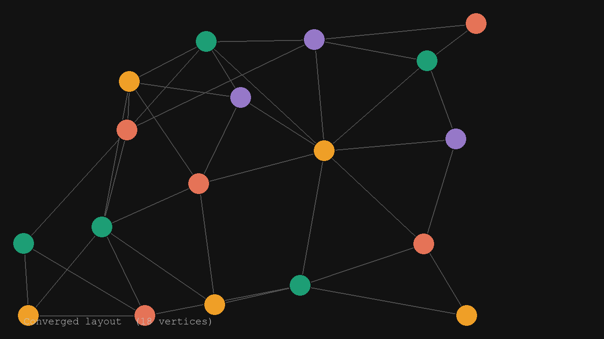
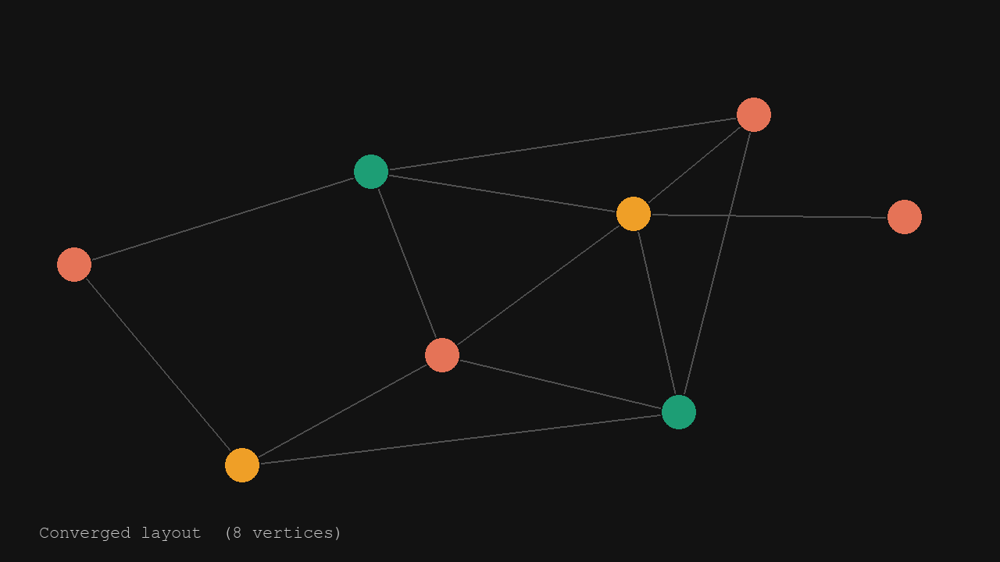

# PCAP Course Project: Graph coloring generator

An interactive pygame visualiser that generates random planar graphs, refines their layout with a Fruchterman-Reingold spring simulation, and colors the vertices greedily.

## Screenshots

| FR layout settling | Converged — 18 vertices | Converged — 8 vertices |
|---|---|---|
|  |  |  |

## What it does

- Generates a random connected planar graph using Delaunay triangulation with random edge thinning
- Animates the layout using the Fruchterman-Reingold force-directed algorithm (warm-started from the Delaunay positions to preserve planarity)
- Colors the vertices with a greedy algorithm (minimising the number of colors used)
- Renders the graph in a pygame window at 60 FPS

## Controls

| Key       | Action                                                       |
|-----------|--------------------------------------------------------------|
| `R`       | Regenerate graph with the current vertex count               |
| `↑` / `↓` | Increase / decrease vertex count (range 6–24) and regenerate |
| `ESC`     | Quit                                                         |

## Setup

```bash
python -m venv .venv
.venv\Scripts\activate      # Windows
pip install -r requirements.txt
```

## Run

```bash
python main.py
```

## Project structure

```
graph.py              — Graph / GraphEmbedding classes and random_planar_graph factory
layout.py             — GraphLayout base class and FruchtermanReingoldLayout
draw.py               — pygame rendering constants and draw() function
main.py               — pygame event loop
make_screenshots.py   — headless script to regenerate screenshots/
```

To regenerate the screenshots:

```bash
python make_screenshots.py
```
